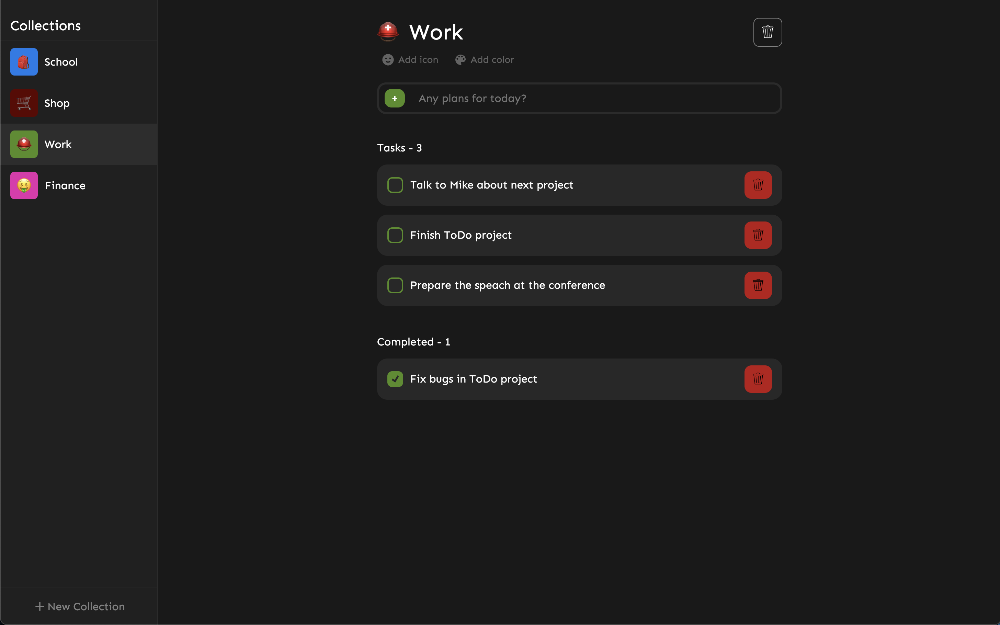

# To-Do
The **To-Do** project is created according to the assignment from **DomDev** [company](https://domdev.pro).
<br>
<br>



### 🔗 **Live preview** of the project is [here](https://alex-dishen.github.io/todo-app/).

## **Features**
* Create collection
* Update collection's name
* Delete collection
* Store tasks inside collections
* Create task
* Update task's name just by clicking on it
* Check task as accomplished
* Delete task
* Local storage
* Emoji picker
* Custom color picker

## **Outcome**
* Used **React**
* Used **Redux Toolkit**
* Used **StyledComponents**
* Learned how to use Redux
* Learned StyledComponents way of styling
* Improved skills of storing and retrieving data

## **Getting Started**
```
HTTPS - git clone https://github.com/alex-dishen/todo-app.git

SSH - git clone git@github.com:alex-dishen/todo-app.git

cd todo-app

npm install

npm start
```

## **Navigation**
* See my previous next [Currency Converter](https://github.com/alex-dishen/currency-converter)
* See my previous project [Memory Card](https://github.com/alex-dishen/memory-card)